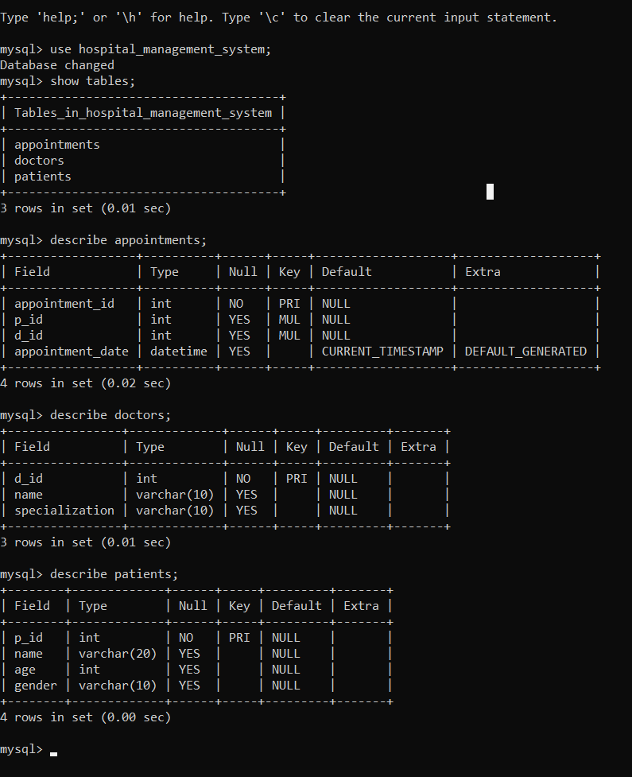

# Hospital Management System

A simple console-based Hospital Management System implemented in Java using JDBC and MySQL.  
This application allows managing patients, doctors, and booking appointments through a command-line interface.

## Features

- Add new patients  
- View all patients  
- View all doctors  
- Book appointments between patients and doctors  
- Basic input validation (checks for existing patients/doctors before booking)
  
## Technologies Used

- Java (JDK 8+)  
- JDBC for database connectivity  
- MySQL as the database  
- Console-based user interface  

## Prerequisites

- Java JDK installed  
- MySQL server installed and running  
- MySQL database named `hospital_management_system` with the following tables:
  - `patients (p_id INT PRIMARY KEY, name VARCHAR, age INT, gender VARCHAR)`  
  - `doctors (d_id INT PRIMARY KEY, name VARCHAR, specialization VARCHAR)`  
  - `appointments (appointment_id INT PRIMARY KEY, p_id INT, d_id INT, appointment_date DATE)`  

## Setup Instructions

1. Clone or download this repository.  
2. Create and configure the MySQL database and tables as per the schema above.  
3. Update the database connection credentials in `Main.java` if necessary:  

   ```java
   private static final String url = "jdbc:mysql://localhost:3306/hospital_management_system";
   private static final String username = "root";
   private static final String password = "your_password";
4. Compile the Java source files:

   ---bash
   javac -cp .:mysql-connector-java-x.x.x.jar org/example/*.java<br>
   (Replace mysql-connector-java-x.x.x.jar with the actual MySQL connector JAR filename)
5. Run the application:

   ---bash
   java -cp .:mysql-connector-java-x.x.x.jar org.example.Main

## Usage

Upon running, you will see a menu:
1. Add Patient  
2. View Patients  
3. View Doctors  
4. Book Appointment  
5. Exit  
Choose the desired option by entering the number.
Follow prompts to enter required information.

## Snapshots
1. Main Menu <br>


2. Add Patient<br>


3. View Patients<br>


4. View Doctors<br>


5. Book Appontments<br>


6. Exit System<br>


7. Database Schema<br>


## Future Improvements

1. Add update and delete operations for patients and doctors.
2. Add input validation and error handling improvements.
3. Implement user authentication for different roles (admin, doctor, patient).
4. Build a GUI or web interface for better usability.
5. Use DAO design pattern and separate business logic from presentation.

## License
This project is open source and free to use.

## Author
https://github.com/Fadeela76

